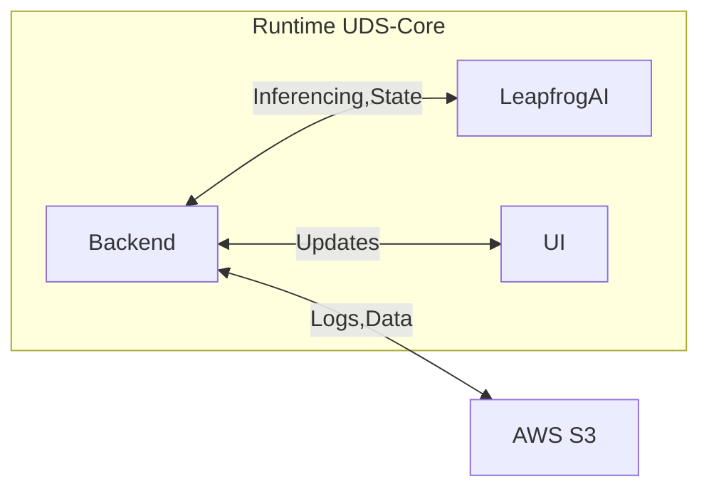

# uds-antx-leapfrogai

[](https://github.com/defenseunicorns-dashdays/uds-antx-leapfrogai/releases)
[](https://github.com/defenseunicorns/uds-core/releases/tag/v0.24.0)
[](https://github.com/defenseunicorns/leapfrogai/releases/tag/v0.9.1)


AI ANTX (Advanced Naval Technology Exercise) FY24 Challenge seeks advanced ML algorithms for translating spoken language into state information at a maritime test event [link](https://www.challenge.gov/?challenge=artificial-intelligence-advanced-naval-technology-exercise-ai-antx-fy24-challenge&tab=judging).

## Challenge Description High Level

The live event will expose 4 tracks (radio-spoken) of audio data every 62s. The goal is to consume, inference, and predict the state of the maritime test event.The states defined include: system checkouts, pre-mission state, active trial, trial pause/delay, post-trial, and return to base. Delays are expected to occur as a result of the system checks, weather, or conflicts in operation area. The algorithms will determine the start of the test event and the predicted temporal impacts of delays as they occur (e.g., estimated time until delay will be resolved). The participants will provide an output display of the test state, clock status, and performance metrics.

The algorithms will log the predicted audio transcripts, test state, delays, and performance metrics. The output will be displayed during the maritime test event to inform the staff and facilitate assessment.

## Requirements and Nominal solution

A User will initiate the state prediction process via the User Interface. The Backend will retrieve data from AWS S3 and send to LeapfrogAI API for inferencing. The API will return/callback(?) the predicted state to teh backend. The backend will update the UI and log the data to AWS S3.



### Logging requirements
- Predicted audio transcripts
- Test state
- Delays
- Performance metrics

### Output Display
- Test State
- Clock Status
- Performance Metrics

## Evaluation Criteria

(ordered by importance)
1. Operational Impact - (use of technology in the intended mission scenarios and operational environment)
2. Operational Impact (future) - (use of technology in future mission scenarios and operational environment)
3. f1 score for test prediction - f1 = 2*((precision*recall)/(precision+recall)
4. precision for test state prediction - Number of True Positives / (Number of True Positives + Number of False Positives)
5. recall for test state prediction - Number of True Positives / (Number of True Positives + Number of False Negatives)
6. accuracy for test state prediction - (Number of Correct Predictions / Total Number of Predictions) * 100
7. mean absolute error (MAE) for time to next state prediction - average absolute difference between the anticipated and actual values of the target variable
8. Root mean Squared Error (RSME) for time to next state prediction - square root of the average squared error between teh target variable and its projected value
9. Word Error Rate (WER) for transcription - WER = (Substitutions + Deletions + Insertions) / Total Words
10. Integration complexity of the technology/engineering innovation
11. Quality and utility of the user interface
12. Average Wait Time - Average time between disruption (defined as something that would cause a delay; weather, system checks, conflicts, etc.) and game clock update


## Deployment of UDS ANTX Solution

See [Deployments](docs/deployments.md)

## Helpful hints for UDS and LFAI deployments

### Building from scratch on WSL2 w/o Docker Desktop
```
git@github.com:defenseunicorns/leapfrogai.git
cd leapfrogai
git checkout kp-wsl2-deployment
make build-k3d-gpu
make create-uds-gpu-cluster
make build-gpu LOCAL_VERSION=dev
cd uds-bundles/latest/gpu
uds create .
uds deploy uds-bundle-leapfrogai-*.tar.zst --confirm
```

- If `supabase-auth` fails to deploy correctly, suggest restarting `pepr-uds-core-watcher` as there is a race condition that is in the queue to fix

### Deploy whisper-distil
(note this is a prebuild zarf package with different configurations than base whisper)

`uds zarf package deploy distil-large-v2-zarf-package-whisper-amd64-dev.tar.zst`


### Deploy metrics
`uds zarf tools kubectl apply -f https://github.com/kubernetes-sigs/metrics-server/releases/latest/download/components.yaml`

### Tearing down cluster
```
k3d cluster delete uds  # kills a running uds cluster
uds zarf tools clear-cache # clears the Zarf tool cache
rm -rf ~/.uds-cache # clears the UDS cache
docker system prune -a -f # removes all hanging containers and images
docker volume prune -f # removes all hanging container volumes
```