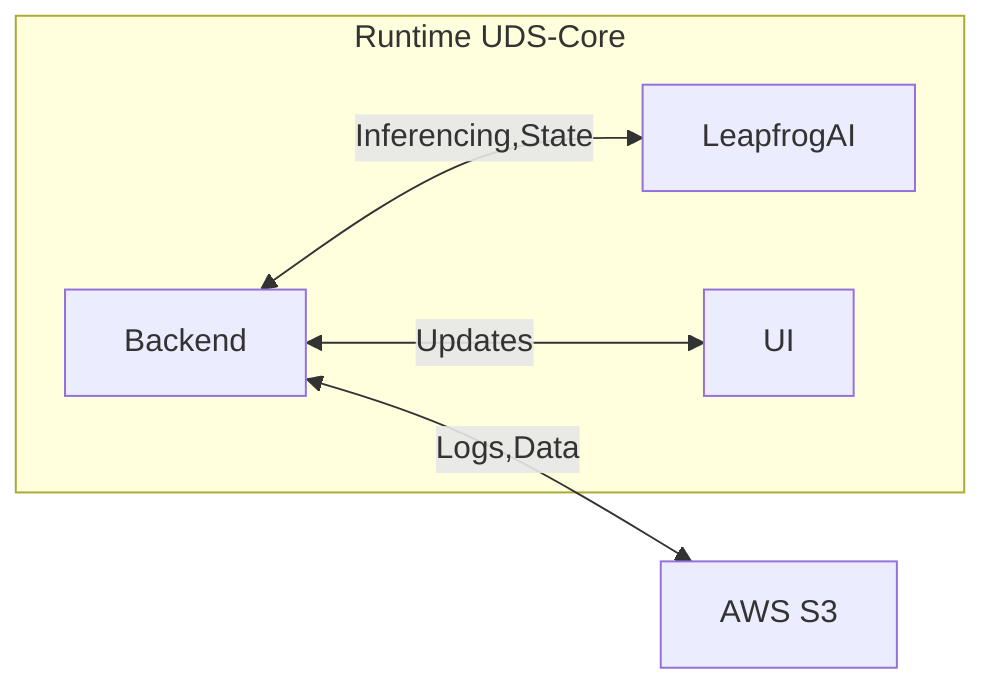

# uds-antx-leapfrogai

AI ANTX (Advanced Naval Technology Exercise) FY24 Challenge seeks advanced ML algorithms for translating spoken language into state information at a maritime test event [link](https://www.challenge.gov/?challenge=artificial-intelligence-advanced-naval-technology-exercise-ai-antx-fy24-challenge&tab=judging).

## Challenge Description High Level

The live event will expose 4 tracks (radio-spoken) of audio data every 62s. The goal is to consume, inference, and predict the state of the maritime test event.The states defined include: system checkouts, pre-mission state, active trial, trial pause/delay, post-trial, and return to base. Delays are expected to occur as a result of the system checks, weather, or conflicts in operation area. The algorithms will determine the start of the test event and the predicted temporal impacts of delays as they occur (e.g., estimated time until delay will be resolved). The participants will provide an output display of the test state, clock status, and performance metrics.

The algorithms will log the predicted audio transcripts, test state, delays, and performance metrics. The output will be displayed during the maritime test event to inform the staff and facilitate assessment.

## Requirements and Nominal solution

A User will initiate the state prediction process via the User Interface. The Backend will retrieve data from AWS S3 and send to LeapfrogAI API for inferencing. The API will return/callback(?) the predicted state to teh backend. The backend will update the UI and log the data to AWS S3.

### Logging requirements
- Predicted audio transcripts
- Test state
- Delays
- Performance metrics

### Output Display
- Test State
- Clock Status
- Performance Metrics